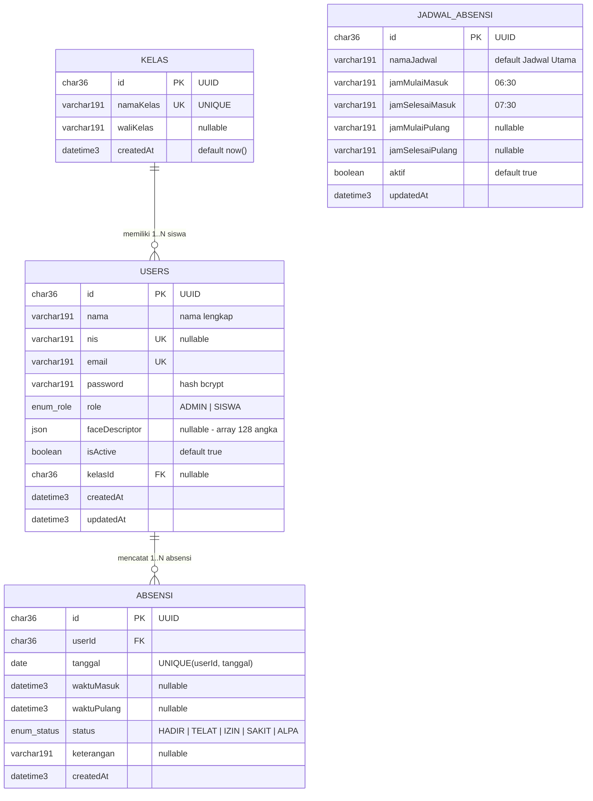

# 📘 Dokumentasi Lengkap Aplikasi AbsensiKu

**Aplikasi Absensi Siswa berbasis Face Recognition**

> Dokumen ini menjelaskan secara lengkap: deskripsi aplikasi, tech stack, struktur folder & kode, struktur database, API, alur kerja (flow), dan cara menjalankan aplikasi.

---

## 📋 Daftar Isi

1. [Deskripsi Aplikasi](#1-deskripsi-aplikasi)
2. [Tech Stack](#2-tech-stack)
3. [Fitur Utama](#3-fitur-utama)
4. [Arsitektur & Alur Data](#4-arsitektur--alur-data)
5. [Struktur Folder & Kode](#5-struktur-folder--kode)
6. [Struktur Database](#6-struktur-database)
7. [API Endpoints](#7-api-endpoints)
8. [Routing Aplikasi](#8-routing-aplikasi)
9. [Alur Fitur Face Recognition](#9-alur-fitur-face-recognition)
10. [Keamanan](#10-keamanan)
11. [Cara Menjalankan](#11-cara-menjalankan)
12. [Akun Default](#12-akun-default)

---

## 1. Deskripsi Aplikasi

**AbsensiKu** adalah aplikasi absensi siswa sekolah berbasis web dengan **pengenalan wajah (face recognition)**. Siswa melakukan absen dengan menghadapkan wajah ke kamera, dan sistem akan mencocokkan wajah tersebut dengan data wajah yang sudah direkam sebelumnya oleh admin.

Aplikasi ini memiliki **2 role pengguna**:

| Role | Deskripsi | Akses |
|------|-----------|-------|
| **ADMIN** | Guru/TU yang mengelola data | Dashboard admin, kelola siswa/kelas/absensi/jadwal |
| **SISWA** | Siswa yang melakukan absen | Dashboard siswa, absen kamera, riwayat pribadi |

**Keunggulan utama:**
- Absen otomatis tanpa kartu/QR — cukup tatap kamera
- Data wajah disimpan sebagai *face descriptor* (array angka 128 dimensi), bukan foto
- Pencocokan wajah hanya terhadap akun yang sedang login (anti kecurangan)
- Ada panduan oval & countdown 3 detik saat absen agar hasil deteksi akurat

---

## 2. Tech Stack

### Daftar Teknologi

| Layer | Teknologi | Versi | Fungsi |
|-------|-----------|-------|--------|
| Runtime | Node.js | LTS | Menjalankan semua kode JS/TS |
| Bahasa | TypeScript | ^5 | Type-safe, mencegah error tipe |
| Framework | **Next.js** (App Router) | 16.2.11 | Full-stack: frontend + backend API dalam satu project |
| UI Library | React | 19.2.4 | Komponen tampilan |
| Styling | Tailwind CSS | ^4 | Styling cepat & konsisten |
| Validasi | Zod | ^4.4.3 | Validasi input form & API |
| ORM | Prisma | ^6.19.3 | Query database type-safe |
| Database | **MySQL** | 8+ | Penyimpanan data utama |
| Face Recognition | face-api.js | ^0.22.2 | Deteksi & pengenalan wajah (client-side) |
| Auth | NextAuth.js | ^4.24.15 | Login & sesi JWT |
| Password | bcryptjs | ^3.0.3 | Hash password |
| Primary Key | UUID | — | ID unik (CHAR(36)) |

### Hierarki Teknologi

```
Node.js (runtime)
   ↓
TypeScript (bahasa)
   ↓
React (library UI)
   ↓
Next.js (framework full-stack)
   ↓
Prisma · Zod · Tailwind · NextAuth · face-api.js (tools)
```

### Alur Data Sistem

```
[Browser: Kamera + face-api.js]
        ↓ kirim face descriptor (array 128 angka)
[Next.js API Routes + validasi Zod]
        ↓
[Prisma Client]
        ↓
[MySQL Database]
```

---

## 3. Fitur Utama

| # | Fitur | Status |
|---|-------|--------|
| 1 | Login & Register (role admin/siswa) | ✅ Selesai |
| 2 | CRUD data siswa (tambah, edit, hapus, lihat) | ✅ Selesai |
| 3 | CRUD data kelas | ✅ Selesai |
| 4 | CRUD & monitoring absensi | ✅ Selesai |
| 5 | Absen via face recognition (kamera) | ✅ Selesai |
| 6 | Pengaturan jadwal absensi (jam masuk/pulang) | ✅ Selesai |
| 7 | Rekam wajah siswa (admin) | ✅ Selesai |
| 8 | Riwayat absensi panel siswa | ✅ Selesai |
| 9 | Proteksi akses berbasis role (middleware) | ✅ Selesai |

**Detail fitur absen face recognition:**
- Panduan **oval** muncul langsung saat kamera terbuka
- Deteksi posisi wajah harus berada di dalam oval (toleransi 1.3x)
- **Countdown 3 detik** otomatis setelah wajah pada posisi benar
- Confidence bar real-time (hijau = siap, abu-abu = mencari wajah)
- Status absen otomatis: **HADIR** (dalam jam) / **TELAT** (lewat jam)
- Cegah absen ganda (1 siswa max 1 absen per hari)

---

## 4. Arsitektur & Alur Data

### 4.1 Flow Login → Role → Panel

```
[Landing / Login]
        ↓
   ┌────┴────┐
   │  Login  │──→ Cek role dari database
   └─────────┘
        ↓
   ┌────┴─────────┐
   │              │
[ADMIN]         [SISWA]
   │              │
/admin/*        /siswa/*
```

### 4.2 Flow Absen Siswa

```
[Buka halaman /siswa/absen]
        ↓
[Kamera terbuka + oval guide muncul]
        ↓
[face-api.js deteksi wajah setiap 500ms]
        ↓
┌───────────────────────────────┐
│ Posisi wajah DI DALAM oval ?  │──→ Tidak → "Arahkan wajah ke oval"
└───────────────────────────────┘
        ↓ Ya
[Countdown 3... 2... 1...]
        ↓
[Kirim face descriptor → POST /api/absen/face]
        ↓
[Hitung Euclidean distance vs wajah user login]
        ↓
┌──────────────┬──────────────────┐
│ distance < 0.45 │ distance ≥ 0.45 │
│ (cocok)         │ (tidak cocok)   │
└──────┬─────────┴──────────────────┘
       ↓
[Cek sudah absen hari ini?]
   ├── Ya → "Kamu sudah absen hari ini"
   └── Tidak → Simpan absensi (HADIR/TELAT) → "Absen berhasil!"
```

### 4.3 Flow Rekam Wajah (Admin)

```
[Admin buka /admin/siswa]
        ↓
[Klik "Rekam" / "Rekam Ulang" pada baris siswa]
        ↓
[Kamera terbuka + oval guide + confidence bar]
        ↓
[Wajah terdeteksi & stabil → otomatis ke tahap konfirmasi]
        ↓
[Klik "Simpan Wajah" → POST /api/siswa/[id]/face]
        ↓
[Face descriptor disimpan di kolom faceDescriptor]
```

### 4.4 Flow Pengaturan Jadwal

```
[Admin buka /admin/jadwal]
        ↓
[Atur: jamMulaiMasuk, jamSelesaiMasuk, jamMulaiPulang, jamSelesaiPulang]
        ↓
[Simpan → POST /api/jadwal]
        ↓
[Saat siswa absen, status dihitung dari jadwal aktif ini]
```

---

## 5. Struktur Folder & Kode

### Struktur Keseluruhan

```
AbsenKu/
├── absensi-app/                    ← Aplikasi utama (Next.js)
│   ├── prisma/
│   │   ├── schema.prisma           ← Definisi model database
│   │   ├── seed.ts                 ← Data awal (admin, kelas, jadwal)
│   │   └── migrations/             ← Riwayat migrasi database
│   ├── public/                     ← Aset statis
│   ├── scripts/
│   │   ├── create_db.sql           ← Script buat database
│   │   └── check_db.sql            ← Script cek database
│   ├── src/
│   │   ├── app/                    ← Routing & halaman (App Router)
│   │   ├── components/             ← Komponen React reusable
│   │   ├── lib/                    ← Utilitas (auth, prisma, validasi)
│   │   ├── types/                  ← Definisi tipe TypeScript
│   │   └── middleware.ts           ← Proteksi akses route
│   ├── package.json                ← Dependencies & scripts
│   ├── tsconfig.json               ← Konfigurasi TypeScript
│   ├── next.config.ts              ← Konfigurasi Next.js
│   └── .env                        ← Environment variables (jangan di-commit)
├── database_absensi.sql            ← SQL dump lengkap (import manual)
├── Agen.md                         ← Context project untuk AI agent
├── Spec.md                         ← Spesifikasi awal aplikasi
└── README.md                       ← Readme singkat
```

### Struktur `src/` Secara Detail

```
src/
├── middleware.ts                     ← NextAuth middleware: proteksi /admin & /siswa
├── app/
│   ├── layout.tsx                    ← Root layout (seluruh app)
│   ├── page.tsx                      ← Landing page (redirect ke /login)
│   ├── globals.css                   ← Styling global (Tailwind)
│   ├── (auth)/                       ← Route group halaman auth
│   │   ├── login/page.tsx            ← Halaman login
│   │   └── register/page.tsx         ← Halaman register siswa (admin)
│   ├── (admin)/admin/                ← Route group panel admin
│   │   ├── layout.tsx                ← Layout panel admin (sidebar/navbar)
│   │   ├── dashboard/page.tsx        ← Dashboard admin
│   │   ├── siswa/page.tsx            ← CRUD siswa + tombol rekam wajah
│   │   ├── kelas/page.tsx            ← CRUD kelas
│   │   ├── absensi/page.tsx          ← Monitoring absensi
│   │   └── jadwal/page.tsx           ← Pengaturan jadwal absen
│   ├── (siswa)/siswa/                ← Route group panel siswa
│   │   ├── layout.tsx                ← Layout panel siswa
│   │   ├── dashboard/page.tsx        ← Dashboard siswa
│   │   ├── absen/page.tsx            ← Absen pakai kamera (fitur utama)
│   │   └── riwayat/page.tsx          ← Riwayat absensi pribadi
│   └── api/                          ← Backend API (Route Handlers)
│       ├── auth/
│       │   ├── [...nextauth]/route.ts ← NextAuth endpoint
│       │   └── register/route.ts      ← Register siswa
│       ├── absen/
│       │   ├── face/route.ts          ← POST: absen face recognition
│       │   └── riwayat/route.ts       ← GET: riwayat absensi siswa
│       ├── siswa/
│       │   ├── route.ts               ← GET (list) / POST (tambah)
│       │   └── [id]/
│       │       ├── route.ts           ← PUT / DELETE siswa
│       │       └── face/route.ts      ← POST: simpan face descriptor
│       ├── kelas/
│       │   ├── route.ts               ← GET / POST kelas
│       │   └── [id]/route.ts          ← PUT / DELETE kelas
│       ├── absensi/
│       │   ├── route.ts               ← GET / POST absensi
│       │   └── [id]/route.ts          ← PUT / DELETE absensi
│       └── jadwal/
│           ├── route.ts               ← GET / POST jadwal
│           └── [id]/route.ts          ← PUT / DELETE jadwal
├── components/
│   ├── face-camera.tsx                ← Komponen kamera + deteksi wajah + oval guide
│   ├── face-capture.tsx               ← Komponen rekap/capture wajah (admin)
│   └── providers.tsx                  ← SessionProvider (NextAuth)
├── lib/
│   ├── auth.ts                        ← Konfigurasi NextAuth (Credentials + JWT)
│   ├── prisma.ts                      ← Singleton PrismaClient
│   └── validations/
│       └── siswa.ts                   ← Schema Zod untuk create/update siswa
└── types/
    └── next-auth.d.ts                 ← Type augmentation session user
```

### Penjelasan Komponen Penting

| File | Tanggung Jawab |
|------|----------------|
| `face-camera.tsx` | Komponen inti kamera: memuat model face-api.js, deteksi wajah tiap 500ms, menggambar oval guide, cek posisi wajah (ellipse equation + buffer 1.3x), countdown 3 detik, confidence bar, menghasilkan face descriptor |
| `face-capture.tsx` | Membungkus `FaceCamera` untuk kebutuhan admin: alur rekam → konfirmasi → simpan wajah |
| `middleware.ts` | Proteksi role: `/admin/*` hanya untuk ADMIN, `/siswa/*` hanya untuk SISWA; belum login → redirect `/login` |
| `lib/auth.ts` | NextAuth dengan CredentialsProvider (login via email **atau** NIS), sesi JWT, token berisi `id`, `role`, `nama` |
| `lib/prisma.ts` | PrismaClient singleton (mencegah koneksi ganda saat hot-reload dev) |

---

## 6. Struktur Database

Database: **MySQL** (`absensi_siswa`) — 4 tabel, 2 enum. Semua primary key **UUID (CHAR(36))** — bukan auto-increment.

### Diagram Relasi

```
┌─────────────┐         ┌─────────────┐
│    kelas    │ 1     N │    users    │
│─────────────│─────────│─────────────│
│ id          │         │ id          │
│ namaKelas   │◄────────│ kelasId  FK │
│ waliKelas   │         │ role        │
│ createdAt   │         │ faceDescriptor
└─────────────┘         └──────┬──────┘
                               │ 1
                               │ N
                        ┌──────┴──────┐
                        │  absensi    │
                        │─────────────│
                        │ id          │
                        │ userId   FK │
                        │ tanggal     │
                        │ status      │
                        └─────────────┘

┌─────────────────────┐
│   jadwal_absensi    │  ← tabel mandiri (tanpa relasi)
│─────────────────────│
│ id                  │
│ jamMulaiMasuk       │
│ jamSelesaiMasuk     │
│ jamMulaiPulang      │
│ jamSelesaiPulang    │
│ aktif               │
└─────────────────────┘
```

### ERD (Mermaid Diagram)

> Versi Mermaid — bisa dirender di GitHub, Mermaid Live Editor (https://mermaid.live), atau VS Code. File lengkap ada di `ERD.md`.



### Tabel 1: `users` (Admin & Siswa)

| Kolom | Tipe | Keterangan |
|-------|------|------------|
| id | CHAR(36) PK | UUID |
| nama | VARCHAR(191) | Nama lengkap |
| nis | VARCHAR(191) UNIQUE | Nomor Induk Siswa (NULL utk admin) |
| email | VARCHAR(191) UNIQUE | Email login |
| password | VARCHAR(191) | Hash bcrypt (bukan plain text) |
| role | ENUM('ADMIN','SISWA') | Default SISWA |
| faceDescriptor | JSON | Array 128 angka hasil face-api.js |
| isActive | BOOLEAN | Akun aktif/nonaktif |
| kelasId | CHAR(36) FK → kelas.id | NULL untuk admin |
| createdAt | DATETIME(3) | Waktu dibuat |
| updatedAt | DATETIME(3) | Waktu diperbarui |

### Tabel 2: `kelas`

| Kolom | Tipe | Keterangan |
|-------|------|------------|
| id | CHAR(36) PK | UUID |
| namaKelas | VARCHAR(191) UNIQUE | Contoh: "X IPA 1" |
| waliKelas | VARCHAR(191) | Nama wali kelas |
| createdAt | DATETIME(3) | Waktu dibuat |

### Tabel 3: `absensi`

| Kolom | Tipe | Keterangan |
|-------|------|------------|
| id | CHAR(36) PK | UUID |
| userId | CHAR(36) FK → users.id | Siswa yang absen |
| tanggal | DATE | Tanggal absen |
| waktuMasuk | DATETIME(3) | Jam masuk |
| waktuPulang | DATETIME(3) | Jam pulang |
| status | ENUM('HADIR','TELAT','IZIN','SAKIT','ALPA') | Default HADIR |
| keterangan | VARCHAR(191) | Catatan (opsional) |
| createdAt | DATETIME(3) | Waktu dibuat |

**Constraint unik:** `@@unique([userId, tanggal])` — 1 siswa hanya bisa 1x absen per hari.
**Index:** `(tanggal, status)` — mempercepat filter laporan.

### Tabel 4: `jadwal_absensi`

| Kolom | Tipe | Keterangan |
|-------|------|------------|
| id | CHAR(36) PK | UUID |
| namaJadwal | VARCHAR(191) | Default "Jadwal Utama" |
| jamMulaiMasuk | VARCHAR(191) | Contoh "06:30" |
| jamSelesaiMasuk | VARCHAR(191) | Contoh "07:30" |
| jamMulaiPulang | VARCHAR(191) | Contoh "15:00" |
| jamSelesaiPulang | VARCHAR(191) | Contoh "16:00" |
| aktif | BOOLEAN | Jadwal aktif/tidak |
| updatedAt | DATETIME(3) | Waktu diperbarui |

### Enum Database

```sql
role           → ENUM('ADMIN', 'SISWA')
statusAbsensi  → ENUM('HADIR', 'TELAT', 'IZIN', 'SAKIT', 'ALPA')
```

### Logika Penentuan Status Absen

```
waktu_sekarang < jamMulaiMasuk          → belum bisa absen (ditahan frontend)
jamMulaiMasuk ≤ waktu_sekarang ≤ jamSelesaiMasuk → HADIR
waktu_sekarang > jamSelesaiMasuk        → TELAT
```

> File `database_absensi.sql` di root project berisi SQL dump lengkap (buat database + tabel + data awal). Bisa diimport via phpMyAdmin atau `mysql -u root -p < database_absensi.sql`.

---

## 7. API Endpoints

Semua endpoint adalah **Route Handlers** Next.js (JSON).

### Autentikasi

| Method | Endpoint | Deskripsi |
|--------|----------|-----------|
| POST | `/api/auth/register` | Register siswa baru (admin) |
| * | `/api/auth/[...nextauth]` | Endpoint NextAuth (login, sesi, logout) |

### Absen & Riwayat

| Method | Endpoint | Deskripsi |
|--------|----------|-----------|
| POST | `/api/absen/face` | Absen via face recognition — kirim `{ faceDescriptor: number[] }` |
| GET | `/api/absen/riwayat` | Riwayat absensi siswa yang login (filter tanggal/bulan) |

### Siswa

| Method | Endpoint | Deskripsi |
|--------|----------|-----------|
| GET | `/api/siswa` | Daftar semua siswa |
| POST | `/api/siswa` | Tambah siswa baru |
| PUT | `/api/siswa/[id]` | Edit data siswa |
| DELETE | `/api/siswa/[id]` | Hapus siswa |
| POST | `/api/siswa/[id]/face` | Simpan face descriptor wajah siswa |

### Kelas

| Method | Endpoint | Deskripsi |
|--------|----------|-----------|
| GET | `/api/kelas` | Daftar kelas |
| POST | `/api/kelas` | Tambah kelas |
| PUT | `/api/kelas/[id]` | Edit kelas |
| DELETE | `/api/kelas/[id]` | Hapus kelas |

### Absensi (Admin)

| Method | Endpoint | Deskripsi |
|--------|----------|-----------|
| GET | `/api/absensi` | Monitoring absensi (filter tanggal/kelas/status) |
| POST | `/api/absensi` | Buat absensi manual |
| PUT | `/api/absensi/[id]` | Koreksi absensi |
| DELETE | `/api/absensi/[id]` | Hapus absensi |

### Jadwal

| Method | Endpoint | Deskripsi |
|--------|----------|-----------|
| GET | `/api/jadwal` | Ambil jadwal aktif |
| POST | `/api/jadwal` | Buat jadwal |
| PUT | `/api/jadwal/[id]` | Update jadwal |

### Contoh Request Absen Face

```json
POST /api/absen/face
{
  "faceDescriptor": [0.0123, -0.0456, 0.0789, "... 128 angka ..."]
}
```

**Response sukses:**
```json
{
  "message": "Absen berhasil! Selamat datang, Andi Pratama",
  "match": true,
  "distance": 0.32,
  "alreadyAbsen": false,
  "absensi": {
    "id": "uuid...",
    "status": "HADIR",
    "waktuMasuk": "2026-08-03T07:05:12.000Z",
    "nama": "Andi Pratama",
    "kelas": "X IPA 1"
  }
}
```

---

## 8. Routing Aplikasi

| URL | Halaman | Role |
|-----|---------|------|
| `/` | Landing (redirect ke login) | Publik |
| `/login` | Halaman login | Publik |
| `/register` | Register siswa | Admin |
| `/admin/dashboard` | Dashboard admin | Admin |
| `/admin/siswa` | Kelola siswa + rekam wajah | Admin |
| `/admin/kelas` | Kelola kelas | Admin |
| `/admin/absensi` | Monitoring absensi | Admin |
| `/admin/jadwal` | Pengaturan jadwal absen | Admin |
| `/siswa/dashboard` | Dashboard siswa | Siswa |
| `/siswa/absen` | Absen pakai kamera | Siswa |
| `/siswa/riwayat` | Riwayat absensi pribadi | Siswa |

---

## 9. Alur Fitur Face Recognition

### 9.1 Teknologi

- **face-api.js** dijalankan **di browser (client-side)**, bukan di server
- Model yang dipakai: TinyFaceDetector + FaceLandmark68 + FaceRecognitionNet
- Wajah dikonversi menjadi **face descriptor**: array 128 angka (float)
- Pencocokan memakai **Euclidean distance**: semakin kecil jarak → semakin mirip

### 9.2 Threshold Kecocokan

```
MATCH_THRESHOLD = 0.45

0.0 – 0.40  →  sangat cocok (wajah sama)
0.40 – 0.50 →  cocok (di bawah threshold 0.45)
> 0.50      →  berbeda (wajah orang lain)
```

### 9.3 Posisi Wajah (Oval Guide)

- Oval digambar langsung saat kamera siap (sebelum deteksi wajah berjalan)
- Posisi wajah dicek dengan **ellipse equation** terhadap pusat oval
- Detection zone **1.3x lebih besar** dari oval visual (toleransi)
- Ukuran wajah harus masuk akal: 1%–60% dari area frame
- Jika wajah keluar dari oval saat countdown → countdown **dibatalkan & reset**

### 9.4 Countdown 3 Detik

1. Wajah masuk oval → countdown **3-2-1** dimulai otomatis
2. Descriptor wajah di-refresh tiap 500ms selama countdown (selalu pakai yang terbaru)
3. Countdown selesai → otomatis kirim ke API (tanpa klik tombol)

---

## 10. Keamanan

| Aspek | Implementasi |
|-------|--------------|
| **Password** | Di-hash dengan **bcrypt** (cost 10), tidak pernah disimpan plain text |
| **Sesi** | NextAuth JWT dengan `NEXTAUTH_SECRET` |
| **Proteksi route** | Middleware: `/admin/*` hanya ADMIN, `/siswa/*` hanya SISWA |
| **Proteksi API** | `getServerSession` di setiap API route; role dicek (401 jika bukan SISWA/ADMIN) |
| **Anti kecurangan wajah** | Wajah hanya dibandingkan dengan **face descriptor user yang login** — bukan semua siswa. Jadi login pakai akun teman, absen pakai wajah sendiri → **gagal** |
| **Validasi input** | Semua input form & API divalidasi **Zod** (misal: NIS 1–20 karakter, email valid, password min 6 karakter) |
| **Cegah absen ganda** | Constraint unik `(userId, tanggal)` + cek sebelum insert |
| **Face descriptor valid** | Harus array minimal 100 angka, jika tidak → 400 |
| **.env** | Berisi kredensial database & secret — **tidak ikut di-commit** (ada di .gitignore) |

---

## 11. Cara Menjalankan

### Prasyarat

| Tool | Versi |
|------|-------|
| Node.js | 18+ |
| MySQL | 8+ (XAMPP / Laragon / standalone) |

### Langkah

```bash
# 1. Masuk ke folder aplikasi
cd absensi-app

# 2. Install dependencies
npm install

# 3. Setup database (pilih salah satu)
#    Cara A — import SQL langsung (sudah ada data awal):
mysql -u root -p < ../database_absensi.sql

#    Cara B — pakai Prisma migrate + seed:
npx prisma migrate dev --name init
npm run seed

# 4. Buat file .env (salin dari .env.example)
cp .env.example .env
#    Isi DATABASE_URL, NEXTAUTH_SECRET, NEXTAUTH_URL

# 5. Jalankan aplikasi
npm run dev
```

Buka **http://localhost:3000**

### Script NPM yang Tersedia

| Script | Perintah | Fungsi |
|--------|----------|--------|
| `dev` | `next dev` | Mode development |
| `build` | `next build` | Build produksi |
| `start` | `next start` | Jalankan hasil build |
| `lint` | `eslint` | Cek kualitas kode |
| `seed` | `npx prisma db seed` | Isi data awal |
| `setup` | `npx prisma db push && npm run seed` | Setup database sekali jalan |

---

## 12. Akun Default

| Role | Email | Password |
|------|-------|----------|
| **Admin** | `admin@sekolah.com` | `admin123` |
| **Siswa contoh** | `andi@sekolah.com` | `siswa123` |
| **Siswa contoh** | `budi@sekolah.com` | `siswa123` |
| **Siswa contoh** | `citra@sekolah.com` | `siswa123` |

---

## 📌 Ringkasan

**AbsensiKu** adalah aplikasi absensi sekolah modern yang memanfaatkan **face recognition** untuk menggantikan absen manual. Dibangun dengan **Next.js 16 + TypeScript + Tailwind + Prisma + MySQL + face-api.js + NextAuth**, aplikasi ini mencakup autentikasi dua role, CRUD lengkap (siswa, kelas, absensi, jadwal), absen kamera dengan panduan oval + countdown, rekam wajah oleh admin, dan riwayat absensi — semuanya dengan proteksi akses dan validasi yang ketat.
