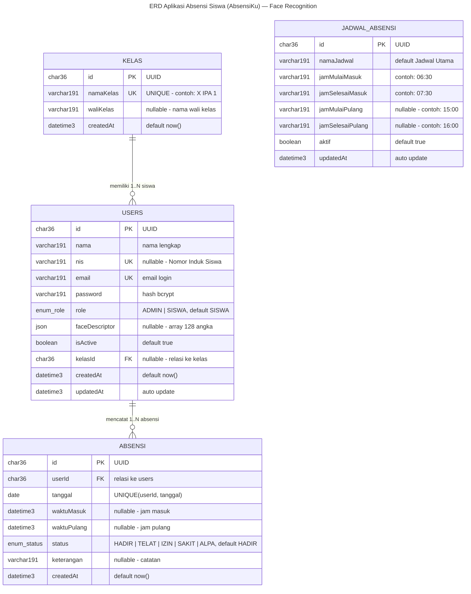
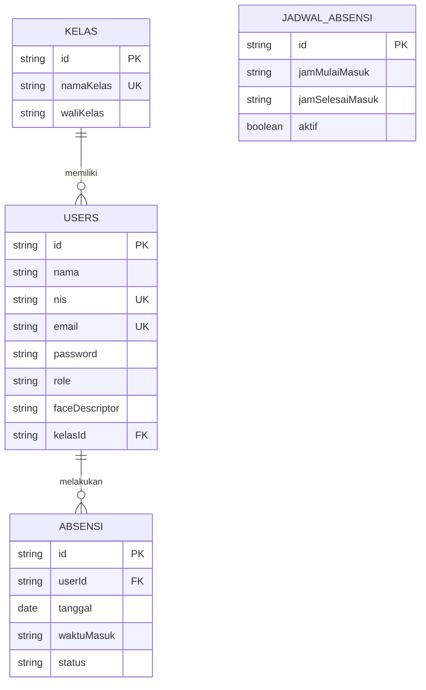

# 🗄️ ERD — Aplikasi AbsensiKu (Face Recognition)

Diagram ERD database `absensi_siswa` dalam format **Mermaid**. Copy blok kode di bawah ke file `.md` yang mendukung Mermaid (GitHub, GitLab, VS Code + extension, Mermaid Live Editor: https://mermaid.live).

## 📊 ERD Utama (4 Tabel + Relasi)

## 🔑 Keterangan

| Simbol | Arti |
|--------|------|
| `PK` | Primary Key (UUID, CHAR(36)) |
| `FK` | Foreign Key |
| `UK` | Unique Key |
| `||--o{` | One-to-Many (1 kelas → banyak users, 1 user → banyak absensi) |
| `enum_role` | `ENUM('ADMIN','SISWA')` |
| `enum_status` | `ENUM('HADIR','TELAT','IZIN','SAKIT','ALPA')` |

## 📌 Catatan Relasi

- **`kelas` 1 — N `users`**: satu kelas menampung banyak siswa (`users.kelasId → kelas.id`). Admin tidak punya kelas (`kelasId = NULL`).
- **`users` 1 — N `absensi`**: satu siswa punya banyak catatan absensi (`absensi.userId → users.id`).
- **`jadwal_absensi`**: tabel mandiri (tanpa relasi) — dipakai sebagai pengaturan jam absen global.
- **Constraint unik**: `absensi(userId, tanggal)` → satu siswa hanya boleh absen 1× per hari.

---

## 🎨 Bonus: ERD Versi Simpel (Ringkas)

